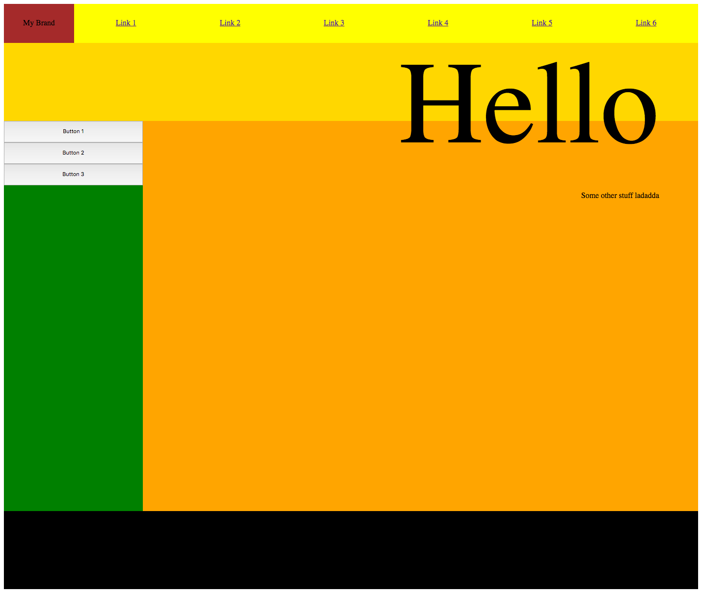

# CSS Grid Practice

This app was created to learn the basics of CSS Grid. 

This app demonstrates: 

1. Positioning of elements using grid
2. Overlaying of elements using grid
3. Use of media query breakpoints to change the grid layout

